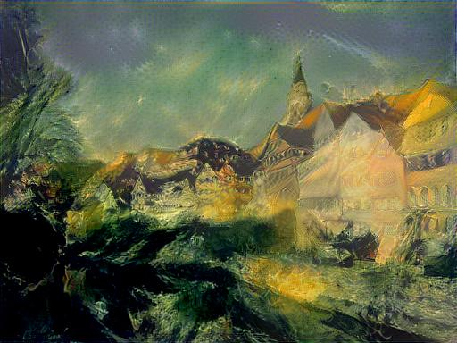
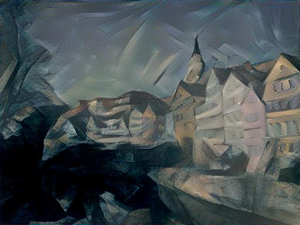
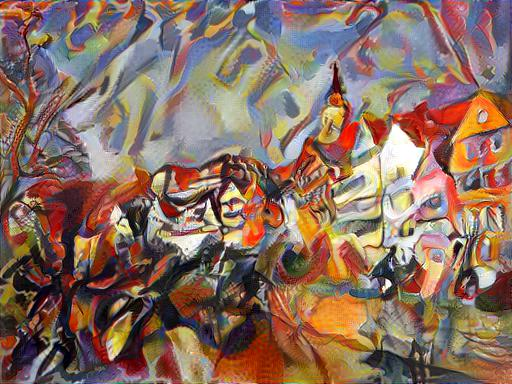
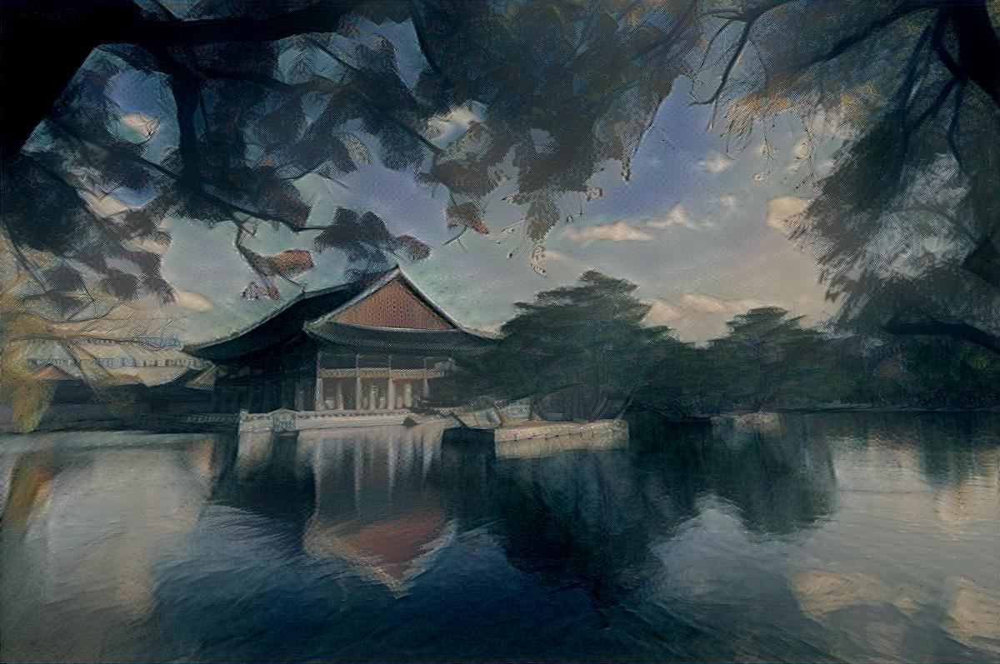

# Style Transfer (Neural Style)

A tensorflow implementation of style transfer (neural style) described in the papers:
* [A Neural Algorithm of Artistic Style](https://arxiv.org/pdf/1508.06576v2.pdf) : *submitted version*
* [Image Style Transfer Using Convolutional Neural Networks](http://www.cv-foundation.org/openaccess/content_cvpr_2016/papers/Gatys_Image_Style_Transfer_CVPR_2016_paper.pdf) : *published version*  
by Leon A. Gatys, Alexander S. Ecker, Matthias Bethge

## Usage

### Prerequisites
1. Tensorflow
2. Python packages : numpy, scipy, PIL, matplotlib
3. Pretrained VGG19 file : [imagenet-vgg-verydeep-19.mat](http://www.vlfeat.org/matconvnet/models/imagenet-vgg-verydeep-19.mat)

&nbsp;&nbsp;&nbsp;&nbsp;&nbsp;&nbsp;* Please download the file from link above.  
&nbsp;&nbsp;&nbsp;&nbsp;&nbsp;&nbsp;* Save the file under `pre_trained_models`

### Running
```
python run_main.py --content <content file> --style <style file> --output <output file>
```
*Example*:
`python run_main.py --content images/tubingen.jpg --style images/starry-night.jpg --output result.jpg`

#### Arguments
*Required* :  
* `--content`: Filename of the content image. *Default*: `images/tubingen.jpg`
* `--style`: Filename of the style image. *Default*: `images/starry-night.jpg`
* `--output`: Filename of the output image. *Default*: `result.jpg`  

*Optional* :  
* `--model_path`: Filename of the content image. *Default*: `pre_trained_model`
* `--loss_ratio`: Weight of content-loss relative to style-loss. Alpha over beta in the paper. *Default*: `1e-3`
* `--content_layers`: *Space-separated* VGG-19 layer names used for content loss computation. *Default*: `conv4_2`
* `--style_layers`: *Space-separated* VGG-19 layer names used for style loss computation. *Default*: `relu1_1 relu2_1 relu3_1 relu4_1 relu5_1`
* `--content_layer_weights`: *Space-separated* weights of each content layer to the content loss. *Default*: `1.0`
* `--style_layer_weights`: *Space-separated* weights of each style layer to loss. *Default*: `0.2 0.2 0.2 0.2 0.2`
* `--max_size`: Maximum width or height of the input images. *Default*: `512`
* `--num_iter`: The number of iterations to run. *Default*: `1000`
* `--initial_type`: The initial image for optimization. (notation in the paper : x) *Choices*: content, style, random. *Default*: `'content'`
* `--content_loss_norm_type`: Different types of normalization for content loss. *Choices*: [1](https://arxiv.org/pdf/1508.06576v2.pdf), [2](https://arxiv.org/abs/1604.08610), [3](https://github.com/cysmith/neural-style-tf). *Default*: `3`

## Sample results
### The Neckarfront in Tübingen, Germany
There results were obtained from default setting.
An image was generated approximately after 4 mins on GTX 980 ti.

<p align="center">







</p>

### The Gyeongbokgung Palace in Seoul, South Korea
There results were obtained from default setting except `--max_size 1200`
An image was generated approximately after 19.5 mins on  GTX 980 ti.

<p align="center">





</p>

## References

There are some tensorflow implementations about the paper.

#### https://github.com/Hvass-Labs/TensorFlow-Tutorials/blob/master/15_Style_Transfer.ipynb  
* This is a tutorial version. Comments on code are well provided. Some exercises are given to check what you learn.  

#### https://github.com/anishathalye/neural-style  
* This is a simple implemetation, but optimizer is not L-BFGS but Adam.  

#### https://github.com/cysmith/neural-style-tf  
* There are other implementations related to style transfer like video style transfer, color-preserving style transfer etc.  

I went through these implementations and found some differences from each other.

1. Style image shape : there are some variations how to resize a style image.
2. Optimizer : gradient descent, Adam, L-BFGS
3. Scale factor of loss : scale factors for content-loss and style-loss are different
4. Total loss : total variance denoising is implemented differently

## Acknowledgements
This implementation has been tested on Tensorflow r0.12.